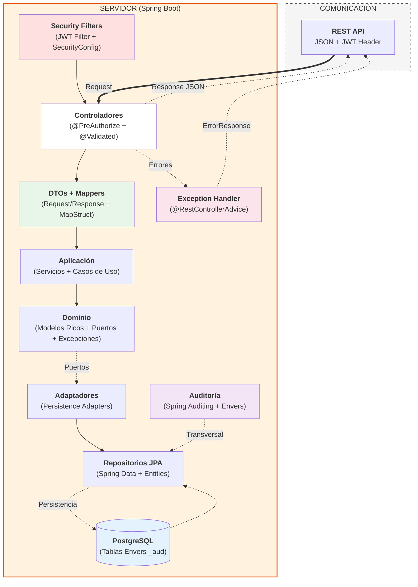

<a id="readme-top"></a>

<div align="center">
  <h1>Klinico API — REST API de Gestión Clínica Hospitalaria</h1>
  <p>Backend Spring Boot que alimenta la app móvil multiplataforma Klinico para el pase de planta hospitalario diario.</p>

  
  
  
  
</div>

---

## Tabla de contenidos

- [Descripción](#descripción)
- [Funcionalidades / Endpoints](#funcionalidades--endpoints)
- [Arquitectura](#arquitectura)
- [Estructura del proyecto](#estructura-del-proyecto)
- [Stack tecnológico](#stack-tecnológico)
- [Primeros pasos](#primeros-pasos)
  - [Prerrequisitos](#prerrequisitos)
  - [Variables de entorno](#variables-de-entorno)
  - [Instalación y ejecución](#instalación-y-ejecución)
- [Documentación API](#documentación-api)
- [Repositorio del frontend](#repositorio-del-frontend)
- [Contacto](#contacto)
- [License](#license)

---

## Descripción

**Klinico API** es el backend REST de la plataforma de gestión clínica hospitalaria **Klinico**. Expone los endpoints que consume la aplicación móvil Flutter [klinico_front](https://github.com/SergioLM7/klinico-front), proporcionando la lógica de negocio para gestionar pacientes, admisiones y episodios clínicos diarios.

La API está diseñada bajo **Arquitectura Hexagonal (Ports & Adapters)** con principios de **Domain-Driven Design (DDD)**, de forma que el núcleo de dominio permanece completamente desacoplado de la capa de infraestructura. Esto permite que el mismo núcleo funcional pueda ser consumido tanto por la app móvil actual como por cualquier otro cliente futuro (web, escritorio).

La autenticación se basa en **JWT (Bearer Token)** y el control de acceso se gestiona mediante roles (`MEDICO`, `JEFESERVICIO`, `ADMINISTRATIVO`, `SYSADMIN`). La trazabilidad de cambios en las entidades críticas se garantiza mediante **Hibernate Envers**.

<p align="right">(<a href="#readme-top">volver arriba</a>)</p>

---

## Funcionalidades principales

- **Gestión de pacientes:** Registro, seguimiento de estados (Alta, Ingresado, Exitus), edición.
- **Ciclo de Admisiones:** Creación, edición, control de ingresos por servicio, flujo de asignación de habitación, flujo para dar de alta al paciente.
- **Episodios Clínicos:** Evolución diaria documentada con escalas médicas (Braden, CHADS2, CAM) y con seguridad para evitar modificación de datos por cualquier otro usuario que no haya creado el episodio clínico.
- **Seguridad y auditoría:** Autenticación basada en JWT, seguridad por roles (Médico, Jefe de Servicio, Administrativo, Sys Admin) y auditoría automática de campos (`createdBy`, `createdAt`. `modifiedBy`, `modifiedAt`) junto a Hibernate Envers para dejar constancia de las diferentes modificaciones de las entidades de máxima relevancia.


<p align="right">(<a href="#readme-top">volver arriba</a>)</p>

---

## Arquitectura

El proyecto implementa una **Arquitectura Hexagonal (Ports & Adapters)** con las siguientes capas:



**Responsabilidades por capa:**

- **Dominio:** Modelos de dominio ricos (reglas de negocio encapsuladas en las propias entidades) e interfaces de repositorio (puertos de salida). No depende de ninguna tecnología externa.
- **Aplicación:** Servicios y casos de uso que orquestan la lógica de negocio coordinando modelos de dominio y puertos.
- **Infraestructura — REST:** Controladores `@RestController` que reciben las peticiones HTTP, aplican validación de entrada y delegan en los servicios de aplicación.
- **Infraestructura — Persistencia:** Adaptadores JPA que implementan los puertos de repositorio del dominio. Usan entidades `@Entity` mapeadas con MapStruct hacia/desde los modelos de dominio.
- **Infraestructura — Seguridad:** Filtro JWT que intercepta cada petición, valida el token y establece el contexto de seguridad de Spring.

<p align="right">(<a href="#readme-top">volver arriba</a>)</p>

---

## Estructura del proyecto

```text
src/
└── main/
    ├── java/com/sergio/klinico/
    │   ├── KlinicoApiApplication.java
    │   ├── domain/
    │   │   ├── models/               # Modelos de dominio ricos (Patient, Admission, Episode, User, Service)
    │   │   │                         #   + enums PatientStatus, UserRole
    │   │   ├── repositories/         # Interfaces de puerto — contratos de persistencia
    │   │   └── exceptions/           # AuthException, BusinessException, CustomException
    │   ├── application/
    │   │   └── services/             # Casos de uso y servicios de aplicación
    │   │                             #   AdmissionService, PatientService, EpisodeService,
    │   │                             #   UserService, KpiService, AuditService,
    │   │                             #   LoginUseCase, FindUserByIdUseCase, ...
    │   └── infrastructure/
    │       ├── config/               # SecurityConfig, JwtAuthenticationEntryPoint
    │       ├── mappers/              # Mappers MapStruct (dominio ↔ entidad JPA / DTO)
    │       ├── persistence/          # Entidades @Entity, adaptadores JPA, JpaRepositories,
    │       │                         #   proyecciones, JpaConfig, AuditableEntity
    │       ├── rest/                 # Controladores @RestController, DTOs (Request/Response),
    │       │                         #   validaciones personalizadas, GlobalExceptionHandler
    │       └── security/             # JwtService (JJWT), JwtAuthenticationFilter
    └── resources/
        └── application.yaml         # Configuración de datasource, JPA, Hibernate Envers, logging
```

<p align="right">(<a href="#readme-top">volver arriba</a>)</p>

---

## Stack tecnológico

| Categoría | Tecnología |
|-----------|-----------|
| Framework | Spring Boot `4.0.3` |
| Lenguaje | Java 25 |
| Build tool | Gradle (Gradle Wrapper incluido) |
| Seguridad | Spring Security + JJWT `0.12.6` |
| Persistencia | Spring Data JPA / Hibernate |
| Auditoría | Hibernate Envers |
| Base de datos | PostgreSQL `17` |
| Mapeo de objetos | MapStruct `1.6.3` |
| Utilidades | Lombok |
| Validación | Spring Validation (Bean Validation) |
| Testing | Spring Boot Test (JUnit 6) |
| Documentación API | springdoc-openapi `3.0.3` (Swagger UI + OpenAPI 3) |

<p align="right">(<a href="#readme-top">volver arriba</a>)</p>

---

## Primeros pasos

### Prerrequisitos

- [JDK 25](https://jdk.java.net/25/) o superior.
- [Docker](https://www.docker.com/) y Docker Compose (para levantar PostgreSQL con un solo comando).
- Gradle no es necesario instalarlo globalmente; el proyecto incluye el **Gradle Wrapper** (`./gradlew`).

### Variables de entorno

Crea un archivo `.env` en la raíz del proyecto (puedes partir del `.env.example` incluido) con las siguientes variables:

| Variable | Descripción | Ejemplo |
|----------|-------------|---------|
| `DB_USER` | Usuario de PostgreSQL | `admin` |
| `DB_PASSWORD` | Contraseña de PostgreSQL | `password` |
| `DB_NAME` | Nombre de la base de datos | `klinico` |
| `JWT_SECRET` | Clave secreta para firmar los tokens JWT (HS256) | `miClaveSecretaMuyLarga` |
| `JWT_EXPIRATION` | Tiempo de expiración del token en milisegundos | 84000 |

> La URL de conexión queda como `jdbc:postgresql://localhost:5434/${DB_NAME}`. El puerto `5434` es el que expone el contenedor Docker definido en `docker-compose.yaml`.

### Instalación y ejecución

```bash
# 1. Clona el repositorio
git clone https://github.com/SergioLM7/klinico-api
cd klinico-api

# 2. Configura las variables de entorno
cp .env.example .env
# Edita .env y añade JWT_SECRET y JWT_EXPIRATION

# 3. Levanta la base de datos con Docker
docker-compose up -d

# 4. Ejecuta la aplicación con el Gradle Wrapper
./gradlew bootRun

# Para generar el JAR ejecutable
./gradlew clean build
java -jar build/libs/klinico-api-0.0.1-SNAPSHOT.jar
```

<p align="right">(<a href="#readme-top">volver arriba</a>)</p>

---

## Documentación API

El proyecto ofrece dos niveles de documentación para la API:

### Swagger UI / OpenAPI 3 (endpoints REST)

Disponible en tiempo de ejecución. Arranca la aplicación y accede a:

| Recurso | URL |
|---------|-----|
| Interfaz interactiva (Swagger UI) | `http://localhost:8080/swagger-ui/index.html` |
| Especificación JSON (OpenAPI 3) | `http://localhost:8080/v3/api-docs` |

La UI permite explorar todos los endpoints agrupados por dominio, ver sus parámetros y respuestas, y ejecutar peticiones directamente desde el navegador. Para los endpoints protegidos haz clic en **Authorize** e introduce el token JWT con el formato `Bearer <token>`.

### Javadoc (código fuente)

Cubre los servicios de aplicación, casos de uso, adaptadores de persistencia y controladores REST.

```bash
# Genera la documentación Javadoc
./gradlew javadoc

# Abre la página principal en tu navegador
open build/docs/javadoc/index.html   # macOS
xdg-open build/docs/javadoc/index.html  # Linux
start build/docs/javadoc/index.html  # Windows
```

El HTML generado queda en `build/docs/javadoc/`.

<p align="right">(<a href="#readme-top">volver arriba</a>)</p>

---

## Repositorio del frontend

La aplicación móvil Flutter que consume esta API está disponible en:

**[https://github.com/SergioLM7/klinico-front](https://github.com/SergioLM7/klinico-front)**

<p align="right">(<a href="#readme-top">volver arriba</a>)</p>

---

## 👨🏽‍💻 Contacto

**Sergio Lillo, Full Stack Software Developer**
<a href="https://www.linkedin.com/in/lillosergio/" target="_blank"></a> - sergiolillom@gmail.com

<p align="right">(<a href="#readme-top">volver arriba</a>)</p>

---

## © MIT License

Copyright (©) 2026, Sergio Lillo

Permission is hereby granted, free of charge, to any person obtaining a copy
of this software and associated documentation files (the "Software"), to deal
in the Software without restriction, including without limitation the rights
to use, copy, modify, merge, publish, distribute, sublicense, and/or sell
copies of the Software, and to permit persons to whom the Software is
furnished to do so, subject to the following conditions:

The above copyright notice and this permission notice shall be included in all
copies or substantial portions of the Software.

THE SOFTWARE IS PROVIDED "AS IS", WITHOUT WARRANTY OF ANY KIND, EXPRESS OR
IMPLIED, INCLUDING BUT NOT LIMITED TO THE WARRANTIES OF MERCHANTABILITY,
FITNESS FOR A PARTICULAR PURPOSE AND NONINFRINGEMENT. IN NO EVENT SHALL THE
AUTHORS OR COPYRIGHT HOLDERS BE LIABLE FOR ANY CLAIM, DAMAGES OR OTHER
LIABILITY, WHETHER IN AN ACTION OF CONTRACT, TORT OR OTHERWISE, ARISING FROM,
OUT OF OR IN CONNECTION WITH THE SOFTWARE OR THE USE OR OTHER DEALINGS IN THE
SOFTWARE.

<p align="right">(<a href="#readme-top">back to top</a>)</p>
